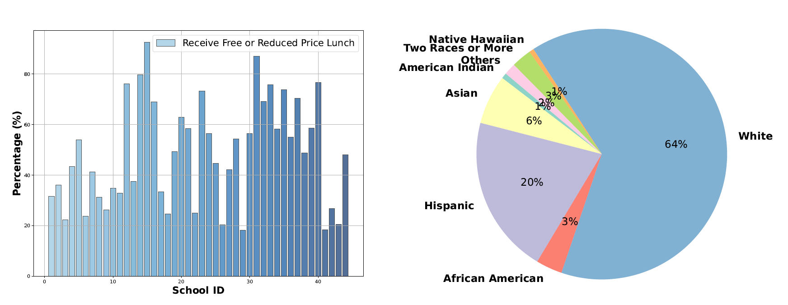

[![CC BY-NC-SA 4.0][cc-by-nc-sa-shield]][cc-by-nc-sa]  

[cc-by-nc-sa]: http://creativecommons.org/licenses/by-nc-sa/4.0/  
[cc-by-nc-sa-shield]: https://img.shields.io/badge/License-CC%20BY--NC--SA%204.0-lightgrey.svg  

# Scalable Early Childhood Reading Performance Prediction

## Overview

This repository contains the data and code associated with the paper **"Scalable Early Childhood Reading Performance Prediction"**. The research focuses on leveraging machine learning models to predict early childhood reading performance, which can empower educators to identify at-risk students and provide early, tailored interventions. The study introduces the **Enhanced Core Reading Instruction (ECRI) dataset**, a large-scale, longitudinal dataset collected from 44 schools involving 6,916 students and 172 teachers.

## Dataset

### Enhanced Core Reading Instruction (ECRI) Dataset

The ECRI dataset is a  longitudinal dataset specifically designed for modeling and predicting future reading performance in early childhood education. The dataset includes:

- **Demographic Data**: Includes student-level information such as special education status, gender, and age.
- **Assessment Data**: Includes various reading assessments, such as Dynamic Indicators of Basic Early Literacy Skills (DIBELS), Stanford Achievement Test, and Woodcock Reading Mastery Test.
- **Intervention Data**: Records the intervention provided to students identified as at-risk for reading difficulties.

<figure>
  
  <figcaption>Visulization of School-level Features. Left: the percentage of schools providing free or reduced-price lunch. Right: student demographics, averaged over schools.</figcaption>
</figure>

### Parameter definition
| Parameter                    | Definition                                                                                  |
|------------------------------|---------------------------------------------------------------------------------------------|
| `Gender`                     | Indicates the gender of student.                                                            |
| `Tx`                         | Binary variable indicating if the student is in control or intervention group.              |
| `Age1b`                      | Age of student.                                                                             |
| `Tier2_N`                    | Number of at-risk readers in class.                                                         |
| `grp_rate`                   | Rate of group practice.                                                                     |
| `rcmistot`                   | Total score of Ratings of Classroom Management and Instructional Support.                   |
| `gnrl_fid`                   | Fidelity of implementation.                                                                 |
| `TKPctCrt`                   | Percentage answered correctly in Teacher Knowledge Survey.                                  |
| `NWFcls`                     | Score for correct letter sounds for Nonsense Word Fluency measure.                          |
| `NWFwrc`                     | Score for words recoded completely and correctly for Nonsense Word Fluency measure.         |
| `ORFwc`                      | Number of words read correctly in one minute for Oral Reading Fluency measure.              |
| `SAwrS`                      | Word reading score for Stanford Achievement Test.                                           |
| `SAsrS`                      | Sentence reading score for Stanford Achievement Test.                                       |
| `SAtoS`                      | Total reading score for Stanford Achievement Test.                                          |
| `RMwidRS`                    | Score on Word Identification for Woodcock Reading Mastery Test.                             |
| `RMwdaRS`                    | Score on Word Attack for Woodcock Reading Mastery Test.                                     |

## License
Our work is licensed under a [Creative Commons Attribution-NonCommercial-ShareAlike 4.0 International License][cc-by-nc-sa].  
